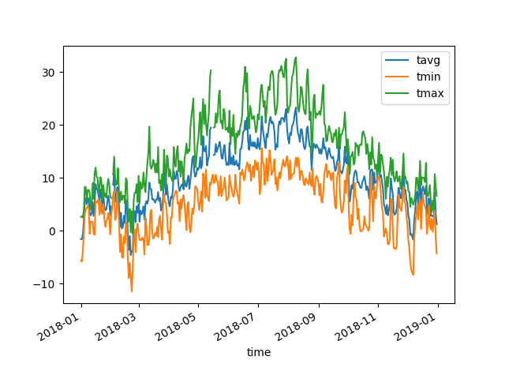

# Python Library

The Meteostat Python library provides simple access to open weather and climate data using Pandas. Historical observations and statistics are obtained from Meteostat's [bulk data interface](/bulk/) and consist of data provided by different public interfaces, most of which are governmental. Among the [data sources](/docs/sources.html) are national weather services like the National Oceanic and Atmospheric Administration (NOAA) and Germany's national meteorological service (DWD).

::: tip Donation
Help Meteostat provide free weather and climate data by donating via [PayPal](https://paypal.me/meteostat).
:::

## Installation

The Meteostat Python package is available through [PyPI](https://pypi.org/project/meteostat/):

```
pip install meteostat
```

Meteostat **requires Python 3.5** or higher. If you want to visualize data, please install Matplotlib, too.

## Example

Let's pretend you want to plot temperature data for Vancouver, BC from 2018:

```python
# Import Meteostat library and dependencies
from datetime import datetime
import matplotlib.pyplot as plt
from meteostat import Point, Daily

# Set time period
start = datetime(2018, 1, 1)
end = datetime(2018, 12, 31)

# Create Point for Vancouver, BC
vancouver = Point(49.2497, -123.1193, 70)

# Get daily data for 2018
data = Daily(vancouver, start, end)
data = data.fetch()

# Plot line chart including average, minimum and maximum temperature
data.plot(y=['tavg', 'tmin', 'tmax'])
plt.show()
```

### Output


